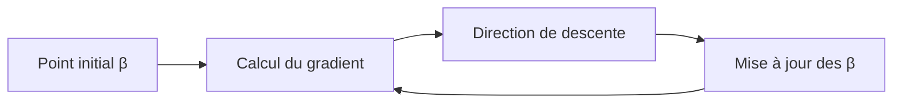

# Fonction de coût

**Permet de trouver automatiquement les meilleurs coefficients $\beta$**


### 🔹 Régression linéaire simple

$$
y = mx + b
$$

Dans le cas simple :

* $m$ → pente
* $b$ → intercept

👉 Cela correspond à une seule feature.

---

### 🔹 Forme généralisée

Pour plusieurs features :

$$
\hat{y} = \sum_{j=0}^{n} \beta_j x_j
$$

ou encore :

$$
\hat{y} = \beta_0 + \beta_1 x_1 + ... + \beta_n x_n
$$

---

## Problème fondamental

👉 Comment trouver les valeurs de $\beta$ ?

* pour 1 feature → solution analytique (OLS)
* pour plusieurs features → impossible à résoudre simplement

➡️ On a besoin d’une nouvelle approche.

---

## Erreur du modèle

Pour une observation $j$ :

$$
\text{erreur}_j = y^{(j)} - \hat{y}^{(j)}
$$

---

### 🔹 Erreur quadratique

On élève au carré pour éviter les signes négatifs :

$$
(y^{(j)} - \hat{y}^{(j)})^2
$$

---

## Fonction de coût (MSE)

On généralise sur toutes les données :

$$
J(\beta) = \frac{1}{m} \sum_{j=1}^{m} (y^{(j)} - \hat{y}^{(j)})^2
$$

---

### 🔹 Version standard en machine learning

On ajoute souvent un facteur $\frac{1}{2}$ :

$$
J(\beta) = \frac{1}{2m} \sum_{j=1}^{m} (y^{(j)} - \hat{y}^{(j)})^2
$$

---

### 📌 Pourquoi le 1/2 ?

:::info Astuce mathématique
Quand on dérive :

$$
\frac{d}{d\beta} (x^2) = 2x
$$

➡️ le facteur $\frac{1}{2}$ permet d’annuler le 2 lors de la dérivation
:::

👉 Cela simplifie les calculs sans changer le résultat final.

---

## Objectif de la fonction de coût

👉 Trouver les coefficients $\beta$ qui minimisent :

$$
J(\beta)
$$

---

## Intuition visuelle

```mermaid
flowchart LR
    A[Coefficients β] --> B[Modèle de régression]
    B --> C[Prédictions ŷ]
    C --> D[Erreur (y - ŷ)]
    D --> E[Erreur quadratique]
    E --> F[Somme globale J(β)]
    F --> G[Minimisation]
    G --> A
```

---

## Interprétation

La fonction de coût :

* mesure la **qualité du modèle**
* est faible → bon modèle
* est élevée → mauvais modèle

---

## Lien avec la prédiction

On remplace :

$$
\hat{y}^{(j)} = \sum_{i=0}^{n} \beta_i x_i^{(j)}
$$

dans la fonction de coût :

$$
J(\beta) = \frac{1}{2m} \sum_{j=1}^{m}
\left(
y^{(j)} - \sum_{i=0}^{n} \beta_i x_i^{(j)}
\right)^2
$$

---

## Problème mathématique

Pour minimiser :

$$
\frac{\partial J(\beta)}{\partial \beta} = 0
$$

👉 Mais en pratique :

❌ impossible à résoudre facilement pour plusieurs variables
❌ trop complexe en grande dimension

---

## Solution : descente de gradient

Quand la solution analytique devient impossible :

> 📌 on utilise un algorithme d’optimisation

---

### 🔹 Principe



---

## Intuition

La descente de gradient :

* commence avec des valeurs aléatoires de $\beta$
* calcule l’erreur
* ajuste les paramètres petit à petit
* jusqu’à minimisation de $J(\beta)$

---

## Pourquoi on en a besoin ?

✔ fonctionne avec plusieurs features
✔ scalable
✔ utilisé dans presque tous les modèles ML modernes

---

## À retenir

* La fonction de coût mesure l’erreur du modèle
* On cherche à minimiser cette erreur
* OLS fonctionne pour les cas simples
* La descente de gradient est nécessaire pour les cas complexes

---

## Prochaine étape

➡️ Comprendre en détail **la descente de gradient** et son fonctionnement intuitif (visuel + mathématique)

---

Si tu veux, le prochain chapitre je peux aussi :
👉 ajouter des visualisations type “loss curve”
👉 ou simuler une descente de gradient étape par étape (très utile pour comprendre vraiment)
