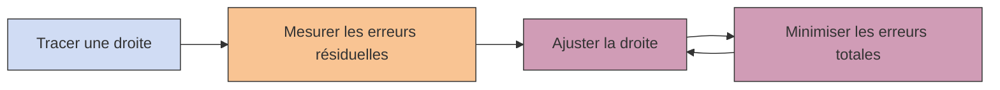

# Introduction

La `régression linéaire` est l’un des algorithmes les plus fondamentaux en machine learning… et aussi l’un des plus anciens. Une relation linéaire, c’est simplement : **une relation en ligne droite**

:::info Exemple : x = y
On peut modéliser parfaitement ces données avec une droite

➡️ Cela implique que pour une nouvelle valeur de x, je peux prédire la valeur de y qui lui est associée.
:::

## Problème dans la vraie vie

❌ **les données ne sont jamais parfaitement alignées** : Où tracer la ligne droite ?

➡️ Nous comprenons que l'objectif est de minimiser la distance gloable entre les points et la ligne donc de **trouver la meilleure droite qui approxime les données avec la plus petite erreur résiduelle** → `La droite de “meilleur ajustement”`

:::tip L'erreur résiduelle
L'erreur résiduelle est la distance entre un point et la droite. Elle être positive ou négative.

:::

## Régression linéaire simple (1 seule feature)

On part de la forme la plus simple : 
$$y = mx + b$$

* `m` → pente de la droite = contrôle **l’inclinaison de la droite**
  * si `m > 0` : la droite **monte** (quand `x` augmente, `y` augmente)
  * si `m < 0` : la droite **descend** (quand `x` augmente, `y` diminue)
  * si `m = 0` : la droite est **horizontale** (aucune relation)
* `b` → intercept (ordonnée à l’origine)
  * valeur de (`y`) quand (`x = 0`)
  * correspond au **point où la droite coupe l’axe vertical**
* `x` → variable explicative (`feature`) = variable d’entrée (ex : surface d’un appartement)
* `y` → variable cible = valeur que l’on cherche à prédire (ex : prix)

:::info 🔹 Intuition visuelle
* `m` fait **pivoter la droite**
* `b` fait **monter ou descendre la droite**

👉 Ensemble, ils définissent complètement la position de la droite.
:::

:::tip Limite : une seule feature
Cette équation ne fonctionne que pour 1 seule variable d’entrée, or en machine learning, on a souvent plusieurs features (surface, pièces, localisation…)
:::

## Régression linéaire à plusieurs features

  
  
➡️

  
  
➡️

  

  
➡️

  

On étend la formule :

$$
\hat{y} = \beta_0 + \beta_1 x_1 + \beta_2 x_2 + \dots + \beta_n x_n = \sum_{j=0}^{n} \beta_j x_j
$$

* $\hat{y}$ → prédiction (et non valeur réelle)
* $\beta$ → coefficients pour chaque feature afin de minimiser l'erreur
* $n$ → nombre de features

:::tip Représentation des données
On peut structurer les données comme une matrice X (features) et un vecteur y (target)
$$
X =
\begin{bmatrix}
x_0^{(1)} & x_1^{(1)} & \cdots & x_n^{(1)} \\
x_0^{(2)} & x_1^{(2)} & \cdots & x_n^{(2)} \\
\vdots & \vdots & \ddots & \vdots \\
x_0^{(m)} & x_1^{(m)} & \cdots & x_n^{(m)}
\end{bmatrix}
,\quad
y =
\begin{bmatrix}
y^{(1)} \\
y^{(2)} \\
\vdots \\
y^{(m)}
\end{bmatrix}
$$
:::

:::warning Objectif
➡️ Trouver les coefficients $\beta$ qui minimisent l’erreur entre la valeurs réelles $y$ et la prédictions $\hat{y}$
:::

## Process résolution régression linéaire

