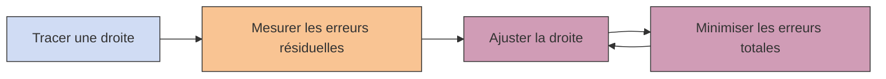

# Introduction à la régression linéaire

La `régression linéaire` est l’un des algorithmes les plus fondamentaux en machine learning… et aussi l’un des plus anciens. Une relation linéaire, c’est simplement : **une relation en ligne droite**

:::info Exemple : x = y
On peut modéliser parfaitement ces données avec une droite

➡️ Cela implique que pour une nouvelle valeur de x, je peux prédire la valeur de y qui lui est associée.
:::

## Problème dans la vraie vie

❌ **les données ne sont jamais parfaitement alignées** : Où tracer la ligne droite ?

➡️ Nous comprenons que l'objectif est de minimiser la distance gloable entre les points et la ligne donc de **trouver la meilleure droite qui approxime les données avec la plus petite erreur résiduelle** → `La droite de “meilleur ajustement”`

:::tip L'erreur résiduelle
L'erreur résiduelle est la distance entre un point et la droite. Elle être positive ou négative.

:::

## Méthode des Moindres Carrés Ordinaires MCO (Ordinary Least Squares - OLS) 

➡️ minimiser l’erreur globale entre les prédictions et les données réelles

$$\sum_{i=1}^{n} (y_i - \hat{y}_i)^2$$

👉 On minimise la somme des erreurs au carré

:::tip Pourquoi le carré ?
* évite l’annulation des erreurs (+ / -)
* pénalise fortement les grosses erreurs
* facilite les calculs mathématiques (dérivées)

➡️ Visiualisation de l'erreur quadratique à minimiser 

:::

## Workflow régression linéaire

