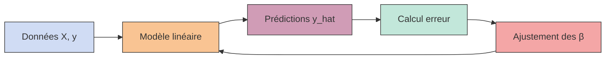

# Méthode des Moindres Carrés Ordinaires MCO (Ordinary Least Squares - OLS) 

*Formaliser mathématiquement la régression linéaire à travers la méthode des Moindres Carrés Ordinaires*

`L’objectif est de comprendre :`
* comment passer des données → à une équation
* comment calculer les coefficients du modèle
* pourquoi cette méthode fonctionne

## Équation d’une droite (rappel)

On part de la forme la plus simple : 
$$y = mx + b$$

* `m` → pente de la droite
* `b` → intercept (ordonnée à l’origine)
* `x` → variable explicative (feature)
* `y` → variable cible (ce que l’on veut prédire)

:::tip Limite : une seule feature
Cette équation ne fonctionne que pour 1 seule variable d’entrée, or en machine learning, on a souvent plusieurs features (surface, pièces, localisation…)
:::

## Généralisation à plusieurs features

  
  
➡️

  
  
➡️

  

  
➡️

  

On étend la formule :

$$
\hat{y} = \beta_0 + \beta_1 x_1 + \beta_2 x_2 + \dots + \beta_n x_n = \sum_{j=0}^{n} \beta_j x_j
$$

* $\hat{y}$ → prédiction (et non valeur réelle)
* $\beta$ → coefficients pour chaque feature afin de minimiser l'erreur
* $n$ → nombre de features

:::tip Représentation des données
On peut structurer les données comme une matrice X (features) et un vecteur y (target)
$$
X =
\begin{bmatrix}
x_0^{(1)} & x_1^{(1)} & \cdots & x_n^{(1)} \\
x_0^{(2)} & x_1^{(2)} & \cdots & x_n^{(2)} \\
\vdots & \vdots & \ddots & \vdots \\
x_0^{(m)} & x_1^{(m)} & \cdots & x_n^{(m)}
\end{bmatrix}
,\quad
y =
\begin{bmatrix}
y^{(1)} \\
y^{(2)} \\
\vdots \\
y^{(m)}
\end{bmatrix}
$$
:::

:::warning Objectif
➡️ Trouver les coefficients $\beta$ qui minimisent l’erreur entre la valeurs réelles $y$ et la prédictions $\hat{y}$
:::

## Régression linéaire simple (1 feature)

$$
\hat{y} = \beta_0 + \beta_1 x
$$

1. Coefficient $\beta_1$ (pente)
$$
\beta_1 =
\frac{\sum (x_i - \bar{x})(y_i - \bar{y})}
{\sum (x_i - \bar{x})^2}
$$

2. Coefficient $\beta_0$ (intercept)

$$
\beta_0 = \bar{y} - \beta_1 \bar{x}
$$

:::tip Exemple concret
Un manager veut modéliser :

* `x` → heures de production
* `y` → volume produit

`Étapes :`

1. Calculer les moyennes :
  * $\bar{x} = 40$
  * $\bar{y} = 134$

2. Calculer :
  * $(x_i - \bar{x})$
  * $(y_i - \bar{y})$

3. Appliquer la formule :
$$
\beta_1 = \frac{558}{124} \approx 4.5
$$
$$
\beta_0 = 134 - (4.5 \times 40) = -46
$$

`Modèle final :`
$$
\hat{y} = -46 + 4.5x
$$

`Interprétation :`
* chaque heure supplémentaire → +4.5 unités produites
* production initiale estimée → -46 (intercept théorique)

`Prédiction :`
Si on veut produire **125 unités** :

$$
125 = -46 + 4.5x
$$

👉 On obtient :

$$
x \approx 38 \text{ heures}
$$
:::

## Limites de la régression linéaire

:::warning Attention
La régression linéaire **ne fonctionne pas toujours**
:::

### Exemple célèbre : Anscombe’s Quartet

Différents datasets peuvent :

* avoir les **mêmes statistiques**
* donner la **même droite**
* mais être **totalement différents visuellement**

👉 Conclusion : Toujours **visualiser les données** !

## Process global

